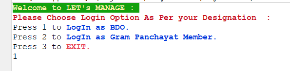
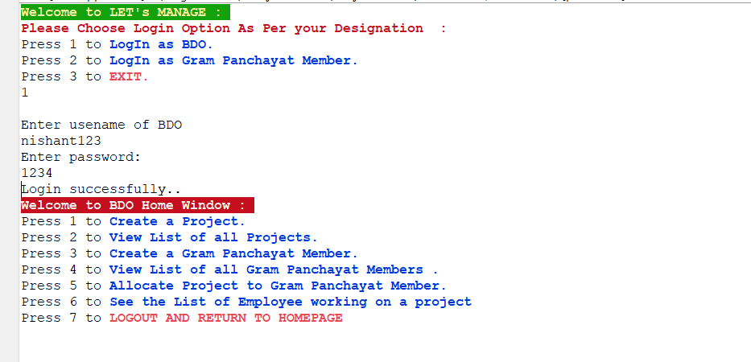
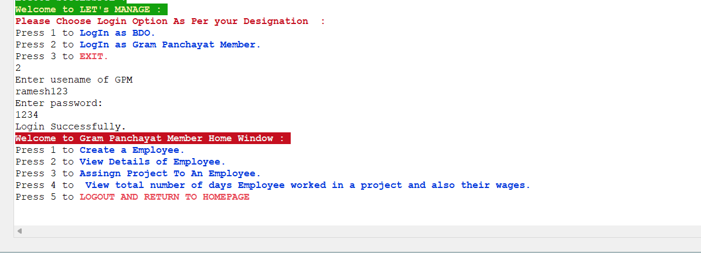
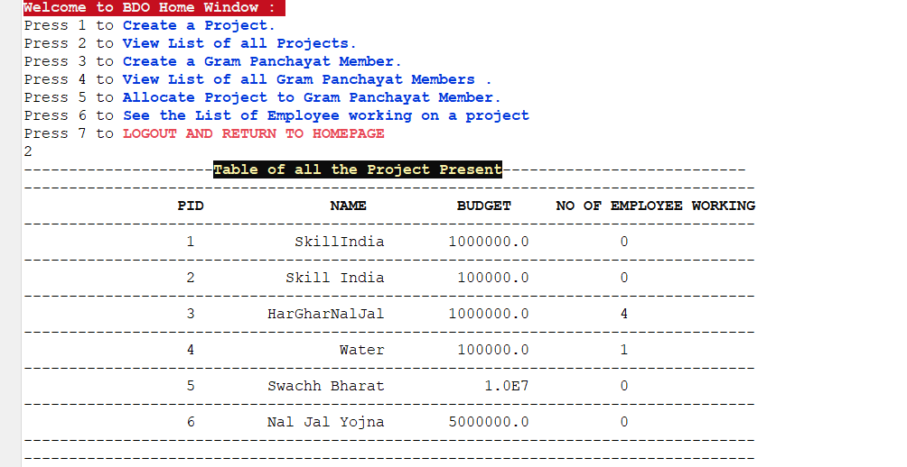
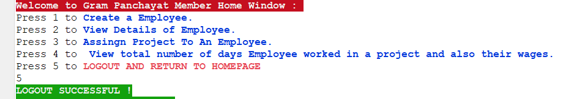
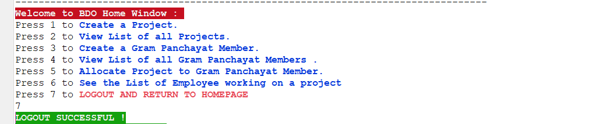

# Let's Manage

<h1>The Mahatma Gandhi National Rural Employment Guarantee Act Backend Application</h1>
 
<h1>Project Logo:</h1>

 

# Description Of The Project :-
The MGNREGA was initiated with the objective of “enhancing livelihood security in rural areas by providing at least 100 days of guaranteed wage employment in a financial year, to every household whose adult members volunteer to do unskilled manual work”.

⚡ Want to Know More About Project 👉: [📼Go through this Video](https://drive.google.com/file/d/1J443RNrX6QWADWm8r4pjwWPDyhA45_8E/view?usp=sharing) 

# Users of this project are :-
• BDO  
• Gram Panchayat Member(GPM)  

<h3>BDO Roles are:</h3>

- BDO can Login into their account
- BDO can Create a project
- BDO can View List Of Project
- BDO can Create new Gram Panchayat Member(GPM)
- BDO can View all the GPM
- BDO can Allocate  Project to GPM
- BDO can See List of Employee working on that Project and their wages

<h3>Gram Panchayat Member(GPM) Roles are:</h3>

- GPM can Login into their Account
- GPM can Create Employee
- GPM can View the Details of Employee
- GPM can Assign Employee to a Project
- GPM can View total number of days Employee worked in a project and also their wages

# Tech stack and Tools used 

- Java
- MySQL
- GitHub

# Experienced Gained

- Gained hands on Experience on application of Java and MySQL Using JDBC.
- Enjoyed the process of learning and creating the application.

# Flow of Application

<h3>Database Schema:</h3>

## **Application Start** 
*HOMEPAGE OF APPLICATION*
 

 
## **BDO Login** 
  
-*BDO Features will be shown after successfully login*
 

 
## **GPM Login** 
-*GPM will be login through crediantial provided by BDO* 
-*GPM username will always be unique which is provided by BDO* 
-*All features of GPM will be shown after successfully login*
 

 

## **GO Back Functionality** 
-*User can go back to the previous option*
 

## **List Of Project**
-*BDO can see the list of project*
 

 
## **GPM LogOut** 
-*GPM can LogOut* 
 
 
 

## **BDO LogOut** 
-*BDo can LogOut* 
 
 
 

# Feedback
 
 Valuable feedback will be appreciated. 
 You can reach out to me via below medium.

- [Linkedin](https://www.linkedin.com/feed/)
# Contributor
#### Nishant Kumar
>[GitHub](https://github.com/kumarnishantgunajn5803)
# Thank you for reading 🤗 ! Visit Again......
